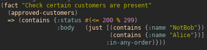
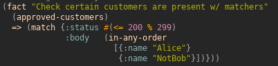
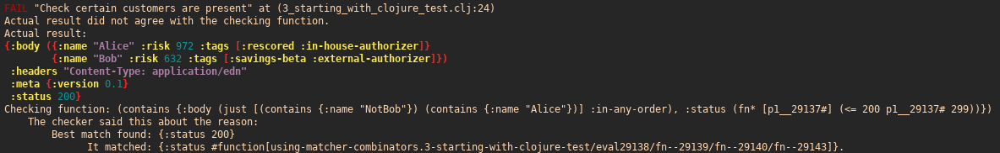
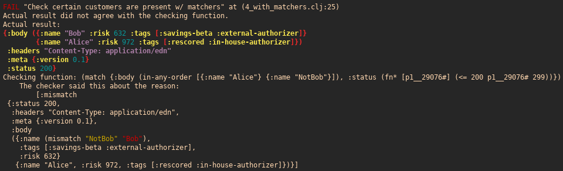

# matcher-combinators

Library for creating matcher combinator to compare nested data structures

_current version:_

[](https://clojars.org/nubank/matcher-combinators)

_docs:_
[Found on cljdoc](https://cljdoc.xyz/d/nubank/matcher-combinators/0.3.1/doc/readme)

## Motivation

Clojure's built-in data structures get you a long way when trying to codify and solve difficult problems. A solid selection of core functions allow you to easily create and access core data structures. Unfortunately, this flexibility does not extend to testing: a comprehensive yet extensible way to assert that the data fits a particular structure seems to be lacking.

This library addresses this issue by providing composable matcher combinators that can be used as building blocks to effectively test functions that evaluate to nested data-structures.

## Features

- Pretty-printed diffs when the actual result doesn't match the expected matcher
- Integrates with clojure.test and midje
- Good readability by providing default interpretations of core clojure data-structures as matcher combinators

| Midje checkers | Matcher combinators |
| ------- | ----- |
|  |  |

| Midje checkers failure output | Matcher combinators failure output |
| ------- | ----- |
|  |  |

## Usage

### Midje:

The `matcher-combinators.midje` namespace defines the `match` and `throws-match` midje-style checkers. These should be used on the right-side of the midje `fact` check arrows (`=>`)

 - `match`: This checker is used to wrap a matcher-combinator asserts that the provided value satisfies the matcher.
 - `throws-match`: This checker wraps a matcher-combinator and optionally a throwable subclass. It asserts that an exception (of the given class) is raised and the `ex-data` satisfies the provided matcher.

For example:

```clojure
(require '[midje.sweet :refer :all]
         '[matcher-combinators.matchers :as m]
         '[matcher-combinators.midje :refer [match]])
(fact "matching a map exactly"
  {:a {:bb 1 :cc 2} :d 3} => (match (m/equals {:a (m/embeds {:bb 1}) :d 3}))
  ;; but when a map isn't immediately wrapped, it is interpreted as an `embeds` matcher
  ;; so you can write the previous check as:
  {:a {:bb 1 :cc 2} :d 3} => (match (m/equals {:a {:bb 1} :d 3})))

(fact "you can assert an exception is thrown "
  ;; Assert _some_ exception is raised and the ex-data inside satisfies the matcher
  (throw (ex-info "foo" {:foo 1 :bar 2})) => (throws-match {:foo 1})

  ;; Assert _a specific_ exception is raised and the ex-data inside satisfies the matcher
  (throw (ex-info "foo" {:foo 1 :bar 2})) => (throws-match ExceptionInfo {:foo 1}))
```

Note that you can also use the `match` checker to match arguments within midje's `provided` construct:

```clojure
(unfinished f)
(fact "using matchers in provided statements"
  (f [1 2 3]) => 1
  (provided
    (f (match [odd? even? odd?])) => 1))
```

### `clojure.test`

Require the `matcher-combinators.test` namespace, which will extend `clojure.test`'s `is` macro to accept the `match?` and `thrown-match?` directives.

 - `match?`: The first argument should be the matcher-combinator represented the expected value, and the second argument should be the expression being checked.
 - `thrown-match?`: The first argument should be a throwable subclass, the second a matcher-combinators, and the third the expression being checked.

For example:

```clojure
(require '[clojure.test :refer :all]
         '[matcher-combinators.test] ;; needed for defining `match?`
         '[matcher-combinators.matchers :as m])
(deftest basic-sequence-matching
  ;; by default a sequentials are interpreted as a `equals` matcher
  (is (match? [1 odd?] [1 3]))
  (is (match? (m/prefix [1 odd?]) [1 1 2 3])))

(deftest exception-matching
  (is (thrown-match? ExceptionInfo
                     {:foo 1}
                     (throw (ex-info "an exception" {:foo 1 :bar 2})))))
```

## Matchers

### default matchers

If a data-structure isn't wrapped in a specific matcher-combinator the default interpretation is:
- map: `embeds`
- sequential: `equals`
- set: `equals`
- number, date, and other base data-structure: `equals`
- regex: `regex`

### built-in matchers

- `equals` operates over base values, maps, sequences, and sets

  - base values (string, int, function, etc.): matches when the given value is exactly the same as the `expected`.
  - map: matches when
      1. the keys of the `expected` map are equal to the given map's keys
      2. the value matchers of `expected` map matches the given map's values
  - sequence: matches when the `expected` sequences's matchers match the given sequence. Similar to midje's `(just expected)`
  - set: matches when all the elements in the given set can be matched with a matcher in `expected` set and each matcher is used exactly once.
- `embeds` operates over maps, sequences, and sets
  - map: matches when the map contains some of the same key/values as the `expected` map.
  - sequence: order-agnostic matcher that will match when provided a subset of the `expected` sequence. Similar to midje's `(contains expected :in-any-order :gaps-ok)`
  - set: matches when all the matchers in the `expected` set can be matched with an element in the provided set. There may be more elements in the provided set than there are matchers.
- `prefix` operates over sequences

  matches when provided a (ordered) prefix of the `expected` sequence. Similar to midje's `(contains expected)`
- `in-any-order` operates over sequences

  matches when the given a sequence that is the same as the `expected` sequence but with elements in a different order.  Similar to midje's `(just expected :in-any-order)`

- `set-equals`/`set-embeds` similar behavior to `equals`/`embeds` for sets, but allows one to specify the matchers using a sequence so that duplicate matchers are not removed. For example, `(equals #{odd? odd?})` becomes `(equals #{odd})`, so to get arround this one should use `(set-equals [odd? odd])`.

- `regex`: matches the `actual-value-found` when provided an `expected-regex` using `(re-find expected-regex actual-value-found)`

### building new matchers

You can extend your data-types to work with `matcher-combinators` by implemented the [`Matcher` protocol](https://github.com/nubank/matcher-combinators/blob/066da1a07ab620a6c63bbb0ce8e1b6b3a4ccd956/src/matcher_combinators/core.clj#L5-L9).

An example of this in the wild can be seen in the `abracad` library [here](https://github.com/nubank/abracad/blob/b52e6a7114461f50bdacc2cf09a1de08f707b9f3/test/abracad/custom_types_test.clj#L15-L20).

## Running tests

The project contains both midje and `clojure.test` tests.

Midje is capable of running both types of tests:

```
lein midje
```
